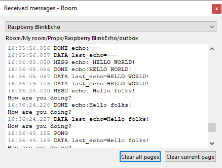
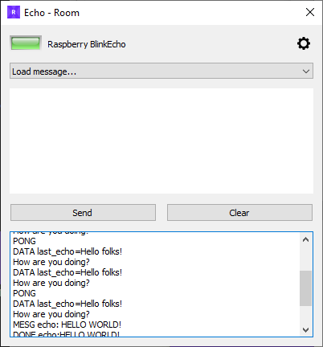

# Blink Echo props
*Example of pure Python props using **asyncio**.*

An educational example which echoes messages and make a LED blinking.


## Installation
See [INSTALLATION.md](.../INSTALLATION.md) and as a good habit is the PyProps folder is `/home/pi/Room/Props/PyProps`

### Dependencies
If you don't install the whole PyProps library, you will have to fulfill the  *PyBlinkEcho* requirements:
* `PyProps/core/AsyncioProps.py`
* `PyProps/core/PropsData.py`
* `PyProps/core/PropsApp.py`
* `PyProps/core/MqttApp.py`
* `PyProps/core/Singleton.py`

And you will have to install following Python packages:
```bash
$ pip3 install paho-mqtt
$ pip3 install PyYAML
```

## Usage
Start `main.py` script in `/home/pi/Room/Props/PyProps/AsyncioProps/PyBlinkEcho`:

```bash
pi@raspberrypi:~ $ python3 ~/Room/Props/PyProps/AsyncioProps/PyBlinkEcho/main.py -s 192.168.1.42 -d

Config: {'host': '192.168.1.42'}
INFO - New periodic action added 'send all data' every 30.0 seconds
INFO - New boolean Publishable 'led' (1/0) with initial=0
INFO - New boolean Publishable 'blinking' (yes/no) with initial=0
INFO - New str Publishable 'last_echo' with initial=---
INFO - New periodic action added 'blink' every 1.0 seconds
INFO - Periodic task created 'send all data' every 30.0 seconds
INFO - Periodic task created 'blink' every 1.0 seconds
WARNING - Program failed to send message (disconnected) : 'DATA led=0 blinking=no last_echo=---'
INFO - Program connected to MQTT server
INFO - Program sending message 'CONNECTED' (mid=1) on Room/My room/Props/Raspberry BlinkEcho/outbox
INFO - Program subscribing to topic (mid=2) : Room/My room/Props/Raspberry BlinkEcho/inbox
INFO - Program subscribing to topic (mid=3) : Room/My room/Control/game:scenario
INFO - Program sending message 'DATA led=0 blinking=no last_echo=---' (mid=4) on Room/My room/Props/Raspberry BlinkEcho/outbox
INFO - Program sending message 'MESG echo on' (mid=5) on Room/My room/Props/Raspberry BlinkEcho/outbox
DEBUG - MQTT message is published : mid=1 userdata={'host': '192.168.1.42', 'port': 1883}
INFO - Message published (mid=1)
DEBUG - MQTT topic is subscribed : mid=2 granted_qos=(1,)
INFO - Program susbcribed to topic (mid=2) with QoS (1,)
DEBUG - MQTT topic is subscribed : mid=3 granted_qos=(1,)
INFO - Program susbcribed to topic (mid=3) with QoS (1,)
```


## SSH relaunch command
The command to relaunch the props is :

```bash
$ ps aux | grep python | grep -v "grep python" | grep PyBlinkEcho/main.py | awk '{print $2}' | xargs kill -9 && screen -d -m python3 /home/pi/Room/Props/PyProps/AsyncioProps/PyBlinkEcho/main.py -s %BROKER%
```


## Blink Echo as a props for <a href="https://xcape.io/" target="_blank">*xcape.io* **Room**</a>
To use *PyBlinkEcho* as a props for <a href="https://xcape.io/" target="_blank">*xcape.io* **Room**</a> software, here are props commands and messages as well as a suggested control panel.

### Props commands
* `blink:0` : deactivate blinking
* `blink:1` : activate blinking
* `echo:a message to be echoed` : echo the message


### Props configuration
Add and configure *Raspberry BlinkEcho* connected props.


### Props data messages



### Props control panel


### Plugin for Blink Echo props
Props control panel cannot display text on multiple lines or send text by the game master, therefore a plugin is necessary: [PyEchoPlugin](https://github.com/xcape-io/PyEchoPlugin)




## Author

**Marie FAURE** (Mar 30th, 2020)
* company: FAURE SYSTEMS SAS
* mail: *dev at faure dot systems*
* github: <a href="https://github.com/xcape-io?tab=repositories" target="_blank">xcape-io</a>
* web: <a href="https://xcape.io/" target="_blank">xcape.io</a>