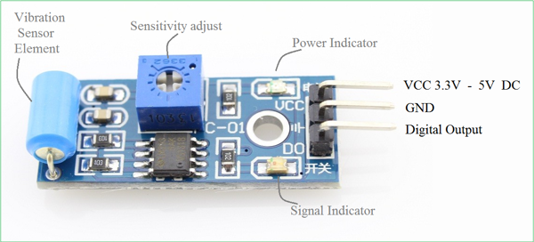
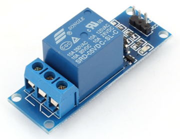

# Crying Doll props
***The doll cries when the players approach when vibrations are detected.***

Two vibration sensors SW-420 are connected to the Raspberry Pi GPIO and tuned to detect human approaching.

When vibration is detected, a sound is picked up randomly among seven audio files and played. The vibration detection can be activated / deactivated and a light is remotely switched on and off.


## Installation
See [INSTALLATION.md](.../INSTALLATION.md) and as a good habit is the PyProps folder is `/home/pi/Room/Props/PyProps`


## Usage
Start `main.py` script in `/home/pi/Room/Props/PyProps/AsyncioProps/PyCryingDollProps`:

```bash
pi@raspberrypi:~ $ python3 ~/Room/Props/PyProps/AsyncioProps/PyCryingDollProps/main.py -s 192.168.1.42 -d
Config: {'host': '192.168.1.42'}
INFO - New boolean Publishable 'light' (1/0) with initial=0
INFO - New boolean Publishable 'crying' (1/0) with initial=0
INFO - New boolean Publishable 'activated' (yes/no) with initial=0
INFO - Setup vibration sensor input pin on 20
INFO - Setup vibration sensor input pin on 21
numid=3,iface=MIXER,name='PCM Playback Route'
  ; type=INTEGER,access=rw------,values=1,min=0,max=3,step=0
  : values=1
Simple mixer control 'PCM',0
  Capabilities: pvolume pvolume-joined pswitch pswitch-joined
  Playback channels: Mono
  Limits: Playback -10239 - 400
  Mono: Playback 400 [100%] [4.00dB] [on]
INFO - Program started
INFO - Program connected to MQTT server
INFO - Program subscribing to topic (mid=1) : Room/My room/Raspberry CryingDoll/inbox
DEBUG - MQTT topic is subscribed : mid=1 granted_qos=(2,)
DEBUG - MQTT message is published : mid=2 userdata={'host': 'localhost', 'port': 1883}

```


## SSH relaunch command
The command to relaunch the props from *<a href="https://xcape.io/" target="_blank">xcape.io</a>* **Room** software is :

```bash
$ ps aux | grep python | grep -v "grep python" | grep PyCryingDollProps/main.py | awk '{print $2}' | xargs kill -9 && screen -d -m python3 /home/pi/Room/Props/PyProps/AsyncioProps/PyCryingDollProps/main.py -s %BROKER%
```


## Vibration sensor
We use two vibration sensors module SW-420 connected on GPIO 20 and 21:



<a href="sensor%2FVibration%20Sensor%20Module%20SW420.pdf" target="_blank">Vibration Sensor Module SW420.pdf</a>


## Relay module
An SRD relay module is connected to GPIO 16 to control the light.




## Props
Props commands:
* `activate:0` : deactivate sensor
* `activate:1` : activate sensor
* `light:off` : switch off the light
* `light:on` : switch off the light
* `cry:_` : trigger crying

Use `activate` to enable the cries at the right time (shen starting a new game or when a challenge is completed).

Use `cry` if automatic detection don't work (sensor calibration issue during a game) r to test sound level.

Props data messages:


## Room control panel

...


## Author

**Marie FAURE** (Mar 30th, 2020)
* company: FAURE SYSTEMS SAS
* mail: *dev at faure dot systems*
* github: <a href="https://github.com/xcape-io?tab=repositories" target="_blank">xcape-io</a>
* web: <a href="https://xcape.io/" target="_blank">xcape.io</a>