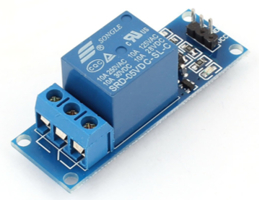
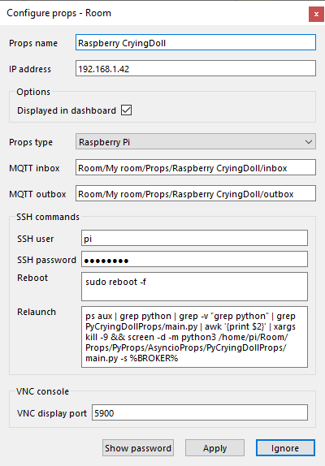
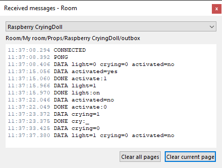
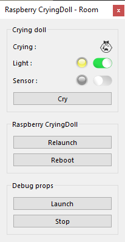

# Crying Doll props (*PyCryingDollProps*)
***The doll cries when the players approach when vibrations are detected.***

Two vibration sensors SW-420 are connected to the Raspberry Pi GPIO and tuned to detect human approaching.

When vibration is detected, a sound is picked up randomly among seven audio files and played. The vibration detection can be activated / deactivated and a light is remotely switched on and off.


## Installation
See [INSTALLATION.md](.../INSTALLATION.md) and as a good habit is the PyProps folder is `/home/pi/Room/Props/PyProps`

### Dependencies
If you don't install the whole PyProps library, you will have to fulfill the  *PyCryingDollProps* requirements:
* `PyProps/core/MqttApp.py`
* `PyProps/core/PropsData.py`
* `PyProps/core/Singleton.py`

And you will have to install following Python packages:
```bash
$ pip3 install paho-mqtt
$ pip3 install PyYAML
```

## Usage
Start `main.py` script in `/home/pi/Room/Props/PyProps/AsyncioProps/PyCryingDollProps`:

```bash
pi@raspberrypi:~ $ python3 ~/Room/Props/PyProps/AsyncioProps/PyCryingDollProps/main.py -s 192.168.1.42 -d

Config: {'host': '192.168.1.42'}
INFO - New periodic action added 'send all data' every 30.0 seconds
INFO - New boolean Publishable 'light' (1/0) with initial=0
INFO - New boolean Publishable 'crying' (1/0) with initial=0
INFO - New boolean Publishable 'activated' (yes/no) with initial=0
INFO - Setup vibration sensor input pin on 20
INFO - Setup vibration sensor input pin on 21
numid=3,iface=MIXER,name='PCM Playback Route'
  ; type=INTEGER,access=rw------,values=1,min=0,max=3,step=0
  : values=1
INFO - Program connected to MQTT server
INFO - Program sending message 'CONNECTED' (mid=1) on Room/My room/Props/Raspberry CryingDoll/outbox
INFO - Program subscribing to topic (mid=2) : Room/My room/Props/Raspberry CryingDoll/inbox
Simple mixer control 'PCM',0
  Capabilities: pvolume pvolume-joined pswitch pswitch-joined
  Playback channels: Mono
  Limits: Playback -10239 - 400
INFO - Program sending message 'DATA light=0 crying=0 activated=no' (mid=3) on Room/My room/Props/Raspberry CryingDoll/outbox
  Mono: Playback 400 [100%] [4.00dB] [on]
DEBUG - MQTT topic is subscribed : mid=2 granted_qos=(2,)
INFO - Program susbcribed to topic (mid=2) with QoS (2,)
DEBUG - MQTT message is published : mid=1 userdata={'host': '192.168.1.42', 'port': 1883}
INFO - Message published (mid=1)
INFO - Periodic task created 'send all data' every 30.0 seconds
DEBUG - MQTT message is published : mid=3 userdata={'host': '192.168.1.42', 'port': 1883}
INFO - Message published (mid=3)
INFO - Program sending message 'DATA light=0 crying=0 activated=no' (mid=4) on Room/My room/Props/Raspberry CryingDoll/outbox
INFO - Message received : '@PING' in Room/My room/Props/Raspberry CryingDoll/inbox
INFO - Program sending message 'PONG' (mid=5) on Room/My room/Props/Raspberry CryingDoll/outbox
```


## SSH relaunch command
The command to relaunch the props is :

```bash
$ ps aux | grep python | grep -v "grep python" | grep PyCryingDollProps/main.py | awk '{print $2}' | xargs kill -9 && screen -d -m python3 /home/pi/Room/Props/PyProps/AsyncioProps/PyCryingDollProps/main.py -s %BROKER%
```


## Vibration sensor
We use two vibration sensors module SW-420 connected on GPIO 20 and 21:


<a href="sensor%2FVibration%20Sensor%20Module%20SW420.pdf" target="_blank">Vibration Sensor Module SW420.pdf</a>


## Relay module
An SRD relay module is connected to GPIO 16 to control the light.




## Crying Doll as a props for <a href="https://xcape.io/" target="_blank">*xcape.io* **Room**</a>
To use *PyCryingDollProps* as a props for <a href="https://xcape.io/" target="_blank">*xcape.io* **Room**</a> software, here are props commands and messages as well as a suggested control panel.

### Props commands
* `activate:0` : deactivate sensor
* `activate:1` : activate sensor
* `light:off` : switch off the light
* `light:on` : switch off the light
* `cry:_` : trigger crying

Use `activate` to enable the cries at the right time (when starting a new game or when a challenge is completed).

Use `cry` if automatic detection doesn't work (sensor failure or calibration issue during a game) or to test sound level.

### Pros configuration
Add and configure *Raspberry CryingDoll* connected props.




### Props data messages



### Props control panel
Configure *Raspberry CryingDoll* control panel using the SVG images  provided in [images folder](images).




## Author

**Marie FAURE** (Mar 30th, 2020)
* company: FAURE SYSTEMS SAS
* mail: *dev at faure dot systems*
* github: <a href="https://github.com/xcape-io?tab=repositories" target="_blank">xcape-io</a>
* web: <a href="https://xcape.io/" target="_blank">xcape.io</a>