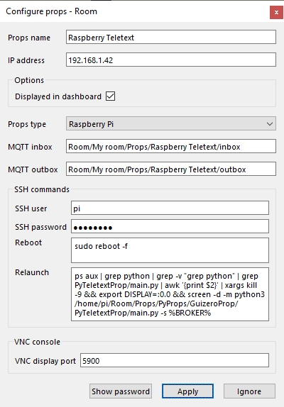
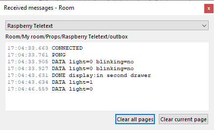
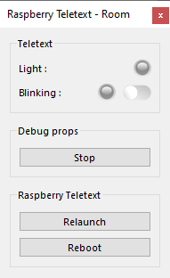
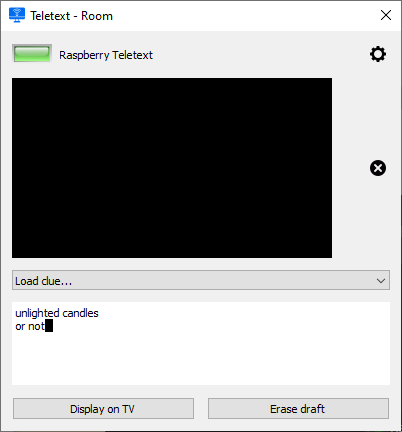

# Teletext prop
***Display messages in the Escape Room with a Raspberry Pi.***

This prop listens to MQTT messages and then displays the text on an HDMI display, rings a bell and turns on a light for 3 seconds.

Messages are sent by the game master with the [Teletext Plugin](https://github.com/xcape-io/TeletextPlugin) or any application able to publish MQTT messages.

The [Teletext Plugin](https://github.com/xcape-io/TeletextPlugin) can be used as a standalone applet, without the need of <a href="https://xcape.io/go/room" target="_blank">Room software</a>. If you use <a href="https://xcape.io/go/room" target="_blank">Room software</a>, you will find <a href="https://xcape.io/public/documentation/en/room/AddaRaspberrypropsTeletext.html" target="_blank">detailed installation help in the Room manual</a>.


## Installation
See [INSTALLATION.md](.../INSTALLATION.md) and as a good habit is the PyProps folder is `/home/pi/Room/Props/PyProps`

### Dependencies
If you don't install the whole PyProps library, you will have to fulfill the  *PyTeletextProp* requirements:
* `PyProps/core/GuizeroProp.py`
* `PyProps/core/PropData.py`
* `PyProps/core/PropApp.py`
* `PyProps/core/MqttApp.py`
* `PyProps/core/Singleton.py`

And you will have to install following Python packages:
```bash
$ pip3 install paho-mqtt
$ pip3 install PyYAML
$ pip3 install guizero
```

## Usage
Start `main.py` script in `/home/pi/Room/Props/PyProps/GuizeroProp/PyTeletextProp`:

```bash
pi@raspberrypi:~ $ python3 ~/Room/Props/PyProps/GuizeroProp/PyTeletextProp/main.py -s 192.168.1.42 -d

Config: {'host': '192.168.1.42'}
INFO - Program connected to MQTT server
INFO - Program sending message 'CONNECTED' (mid=1) on Room/My room/Props/Raspberry Teletext/outbox
INFO - Program subscribing to topic (mid=2) : Room/My room/Props/Raspberry Teletext/inbox
INFO - Program subscribing to topic (mid=3) : Room/My room/Control/game:scenario
DEBUG - MQTT message is published : mid=1 userdata={'host': '192.168.1.42', 'port': 1883}
INFO - Message published (mid=1)
DEBUG - MQTT topic is subscribed : mid=2 granted_qos=(1,)
INFO - Program susbcribed to topic (mid=2) with QoS (1,)
DEBUG - MQTT topic is subscribed : mid=3 granted_qos=(1,)
INFO - Program susbcribed to topic (mid=3) with QoS (1,)
INFO - Message received : '@PING' in Room/My room/Props/Raspberry Teletext/inbox
INFO - Program sending message 'PONG' (mid=4) on Room/My room/Props/Raspberry Teletext/outbox
DEBUG - MQTT message is published : mid=4 userdata={'host': '192.168.1.42', 'port': 1883}
INFO - Message published (mid=4)
numid=3,iface=MIXER,name='PCM Playback Route'
  ; type=INTEGER,access=rw------,values=1,min=0,max=3,step=0
  : values=1
Simple mixer control 'PCM',0
  Capabilities: pvolume pvolume-joined pswitch pswitch-joined
  Playback channels: Mono
  Limits: Playback -10239 - 400
  Mono: Playback -1000 [87%] [-10.00dB] [on]
DEBUG - MQTT message is published : mid=5 userdata={'host': '192.168.1.42', 'port': 1883}
INFO - Message published (mid=5)
INFO - Message received : 'afficher:1515' in Room/My room/Props/Raspberry Teletext/inbox
Room/My room/Props/Raspberry Teletext/inbox afficher:1515
INFO - Program sending message 'afficher:1515' (mid=6) on Room/My room/Props/Raspberry Teletext/display
INFO - Program sending message 'DONE afficher:1515' (mid=7) on Room/My room/Props/Raspberry Teletext/outbox
```

To switch MQTT broker, kill the program and start again with new arguments.


## SSH relaunch command
The command to relaunch the prop is :

```bash
ps aux | grep python | grep -v "grep python" | grep PyTeletextProp/main.py | awk '{print $2}' | xargs kill -9 && export DISPLAY=:0.0 && screen -d -m python3 /home/pi/Room/Props/PyProps/GuizeroProp/PyTeletextProp/main.py -s %BROKER%
```


## PyTeletextProp as a prop for <a href="https://xcape.io/" target="_blank">*xcape.io* **Room**</a>
To use *PyTeletextProp* as a prop for <a href="https://xcape.io/" target="_blank">*xcape.io* **Room**</a> software, here are props commands and messages as well as a suggested control panel.

### Prop commands
* `blink:0` : deactivate blinking
* `blink:1` : activate blinking
* `display:a message to display on the TV` : display the message
* `erase` : clear TV screen

### Prop configuration
Add and configure *Raspberry Teletext* connected prop.




### Prop data messages




### Prop control panel




### Plugin for Teletext prop
The [Teletext Plugin](https://github.com/xcape-io/TeletextPlugin) can be used as a standalone applet, without the need of <a href="https://xcape.io/go/room" target="_blank">Room software</a>. If you use <a href="https://xcape.io/go/room" target="_blank">Room software</a>, you will find <a href="https://xcape.io/public/documentation/en/room/AddaRaspberrypropsTeletext.html" target="_blank">detailed installation help in the Room manual</a>.




## Author

**Faure Systems** (Apr 7th, 2020)
* company: FAURE SYSTEMS SAS
* mail: *dev at faure dot systems*
* github: <a href="https://github.com/xcape-io?tab=repositories" target="_blank">fauresystems</a>
* web: <a href="https://faure.systems/" target="_blank">Faure Systems</a>