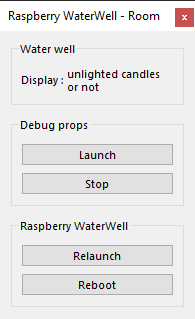
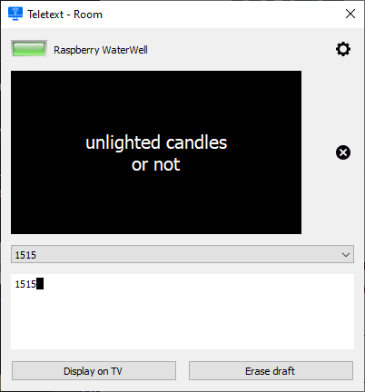

# Water  Well props (*PyWaterWellProps*)
***Display messages with graphic effects in the Escape Room with a Raspberry Pi.***

This props listens to MQTT messages and then displays the text on an HDMI display and rings a bell.

Messages are sent by the game master with the [Teletext Plugin](https://github.com/xcape-io/TeletextPlugin) or any application able to publish MQTT messages.

The [Teletext Plugin](https://github.com/xcape-io/TeletextPlugin) can be used as a standalone applet, without the need of <a href="https://xcape.io/go/room" target="_blank">Room software</a>. If you use <a href="https://xcape.io/go/room" target="_blank">Room software</a>, you will find <a href="https://xcape.io/public/documentation/en/room/AddaRaspberrypropsTeletext.html" target="_blank">detailed installation help in the Room manual</a>.

An advanced graphical effect is used to mimic water waves:


```
uniform vec2 ref_coords;

vec4 effect(vec4 color, sampler2D texture, vec2 tex_coords, vec2 coords)
{
    vec2 distance = 0.025*(coords - ref_coords);
    //float dist_mag = (distance.x*distance.x + distance.y*distance.y);
    float dist_mag = (distance.x*distance.x / 4.0+ distance.y*distance.y / 4.0);
    vec3 multiplier = vec3(abs(sin(dist_mag - time)));
    return vec4(multiplier * color.xyz, 1.0);
}
```

## Installation
Install Kivy with the  ([install-kivy.sh](https://github.com/xcape-io/PyProps/blob/master/KivyProps/PyWaterWellProps/install-kivy.sh)) shell script.

```bash
pi@raspberrypi:~/Room/Props/PyProps/KivyProps/PyWaterWellProps $ chmod a+x install-kivy.sh 
pi@raspberrypi:~/Room/Props/PyProps/KivyProps/PyWaterWellProps $ ./install-kivy.sh 
```


### Dependencies
If you don't install the whole PyProps library, you will have to fulfill the  *PyWaterWellProps* requirements:
* `PyProps/core/KivyProps.py`
* `PyProps/core/Singleton.py`

And you will have to install following Python packages:
```bash
$ pip3 install paho-mqtt
$ pip3 install PyYAML
```

## Usage
Start `main.py` script in `/home/pi/Room/Props/PyProps/KivyProps/PyWaterWellProps`:

```bash
pi@raspberrypi:~ $ python3 ~/Room/Props/PyProps/KivyProps/PyWaterWellProps/main.py -d

[INFO   ] [Logger      ] Record log in /home/pi/.kivy/logs/kivy_20-04-09_108.txt
[INFO   ] [Kivy        ] v2.0.0rc1, git-26228b2, 20200408
[INFO   ] [Kivy        ] Installed at "/usr/local/lib/python3.7/dist-packages/kivy/__init__.py"
[INFO   ] [Python      ] v3.7.3 (default, Dec 20 2019, 18:57:59) 
[GCC 8.3.0]
[INFO   ] [Python      ] Interpreter at "/usr/bin/python3"
[INFO   ] [Factory     ] 184 symbols loaded
[DEBUG  ] [Cache       ] register <kv.lang> with limit=None, timeout=None
[DEBUG  ] [Cache       ] register <kv.image> with limit=None, timeout=60
[DEBUG  ] [Cache       ] register <kv.atlas> with limit=None, timeout=None
[INFO   ] [Image       ] Providers: img_tex, img_dds, img_sdl2, img_pil (img_ffpyplayer, img_gif ignored)
[DEBUG  ] [Cache       ] register <kv.texture> with limit=1000, timeout=60
[DEBUG  ] [Cache       ] register <kv.shader> with limit=1000, timeout=3600
[INFO   ] [Text        ] Provider: sdl2
[INFO   ] [Window      ] Provider: egl_rpi
[DEBUG  ] [Window      ] Actual display size: 1366x768
[INFO   ] [GL          ] Using the "OpenGL ES 2" graphics system
[DEBUG  ] [GL          ] glShaderBinary is not available
[INFO   ] [GL          ] Backend used <gl>
[INFO   ] [GL          ] OpenGL version <b'OpenGL ES 2.0'>
[INFO   ] [GL          ] OpenGL vendor <b'Broadcom'>
[INFO   ] [GL          ] OpenGL renderer <b'VideoCore IV HW'>
[INFO   ] [GL          ] OpenGL parsed version: 2, 0
[INFO   ] [GL          ] Shading version <b'OpenGL ES GLSL ES 1.00'>
[INFO   ] [GL          ] Texture max size <2048>
[INFO   ] [GL          ] Texture max units <8>
[DEBUG  ] [Shader      ] Fragment compiled successfully
[DEBUG  ] [Shader      ] Vertex compiled successfully
[DEBUG  ] [ImageSDL2   ] Load </usr/local/lib/python3.7/dist-packages/kivy/data/glsl/default.png>
[INFO   ] [Window      ] virtual keyboard not allowed, single mode, not docked
[DEBUG  ] [Audio       ] option <gstplayer> ignored by config
[DEBUG  ] [Audio       ] option <ffpyplayer> ignored by config
[DEBUG  ] [Audio       ] register SoundSDL2
[DEBUG  ] [Audio       ] register MusicSDL2
[INFO   ] [Audio       ] Providers: audio_sdl2 (audio_gstplayer, audio_ffpyplayer ignored)
Config: {'host': '192.168.1.42', 'port': 1883}
INFO - Program connected to MQTT server
INFO - Program sending message 'CONNECTED' (mid=1) on Room/My room/Props/Raspberry WaterWell/outbox
INFO - Program subscribing to topic (mid=2) : Room/My room/Props/Raspberry WaterWell/inbox
DEBUG - MQTT message is published : mid=1 userdata={'host': '192.168.1.42', 'port': 1883}
INFO - Message published (mid=1)
DEBUG - MQTT topic is subscribed : mid=2 granted_qos=(1,)
INFO - Program susbcribed to topic (mid=2) with QoS (1,)
INFO - Message received : '@PING' in Room/My room/Props/Raspberry WaterWell/inbox
INFO - Program sending message 'PONG' (mid=3) on Room/My room/Props/Raspberry WaterWell/outbox
DEBUG - MQTT message is published : mid=3 userdata={'host': '192.168.1.42', 'port': 1883}
INFO - Message published (mid=3)

```


## SSH relaunch command
The command to relaunch the props is :

```bash
$ echo host: %BROKER%> /home/pi/Room/Props/PyProps/KivyProps/PyWaterWellProps/.config.yml && ps aux | grep python | grep -v "grep python" | grep PyWaterWellProps/main.py | awk '{print $2}' | xargs kill -9 && screen -d -m python3 /home/pi/Room/Props/PyProps/KivyProps/PyWaterWellProps/main.py
```


## PyWaterWellProps as a props for <a href="https://xcape.io/" target="_blank">*xcape.io* **Room**</a>
To use *PyTeletextProps* as a props for <a href="https://xcape.io/" target="_blank">*xcape.io* **Room**</a> software, here are props commands and messages as well as a suggested control panel.

### Props commands
* `blink:0` : deactivate blinking
* `blink:1` : activate blinking
* `display:a message to display on the TV` : display the message
* `erase` : clear TV screen


### Props configuration
Add and configure *Raspberry WaterWell* connected props.


### Props data messages


### Props control panel




### Plugin for Water Well props
The [Teletext Plugin](https://github.com/xcape-io/TeletextPlugin) can be used as a standalone applet, without the need of <a href="https://xcape.io/go/room" target="_blank">Room software</a>. If you use <a href="https://xcape.io/go/room" target="_blank">Room software</a>, you will find <a href="https://xcape.io/public/documentation/en/room/AddaRaspberrypropsTeletext.html" target="_blank">detailed installation help in the Room manual</a>.




## Author

**Marie FAURE** (Apr 8th, 2020)
* company: FAURE SYSTEMS SAS
* mail: *dev at faure dot systems*
* github: <a href="https://github.com/xcape-io?tab=repositories" target="_blank">xcape-io</a>
* web: <a href="https://xcape.io/" target="_blank">xcape.io</a>