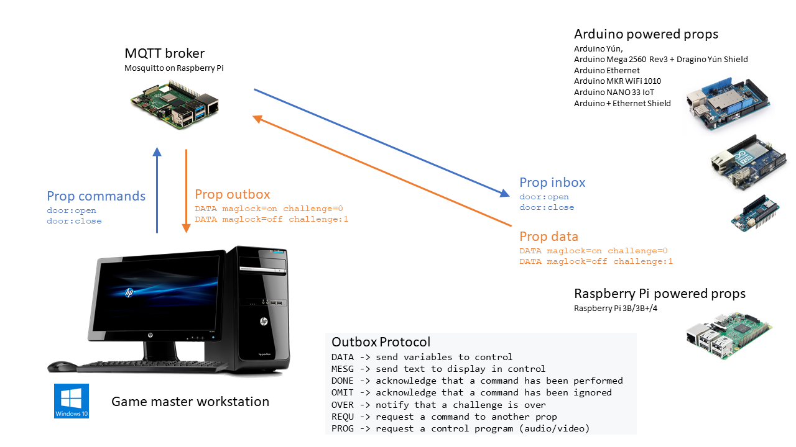

# Room Outbox protocol
***An effective protocol for MQTT messages sent by connected props for Escape Room.***

Connected props for Escape Room exchange data and messages with a MQTT broker.

**Room** Outbox *level 7* protocol (*application level*)  is a minimal implementation to structure messages sent by connected props.

However props may use MQTT topics in any way, for example [Teletext Props](https://github.com/xcape-io/PyProps/tree/master/GuizeroProp/PyTeletextProp) publishes its displayed text as a *retained* message in a dedicated MQTT topic.

## Outbox
**Room** Outbox protocol defines messages sent in props outbox, which is a MQTT topic structured like this:
```python
Room/Name of the room/Props/Name of the prop/outbox
```
For example:
```python
Room/My room/Props/Raspberry Echo/outbox
```

## Inbox
The prop also subscribes to its dedicated inbox topic to listen to command such as actuators:
```python
Room/Name of the room/Props/Name of the prop/inbox
```
For example:
```python
Room/My room/Props/Raspberry Echo/inbox
```

## Protocol for outbox
The protocol has been defined to be **human readable** (so debugging Escape Room is easy) and  **simple to parse** (so low-end MCU can parse it quickly, such as Arduino):

* `CONNECTED` is sent when the prop is connected to the MQTT broker
* `DISCONNECTED` is set as the MQTT *will* for the outbox topic
* `DATA var1=value1 var2=value2` to report sensors or challenge state
* `REQU command` to send a request to another prop
* `PROG command` to send a program request to the Escape Game controller (**Room** software)
* `DONE command` to report that a command has been received and done
* `OMIT command` to report that an unsupported command has been received and ignored
* `OVER command` to report that an Escape Game challenge has been complete
* `MESG any interesting stuff to report`




## Author
**Marie FAURE** (Oct 9th, 2019)
* company: FAURE SYSTEMS SAS
* mail: *dev at faure dot systems*
* github: <a href="https://github.com/xcape-io?tab=repositories" target="_blank">fauresystems</a>
* web: <a href="https://faure.systems/" target="_blank">Faure Systems</a>