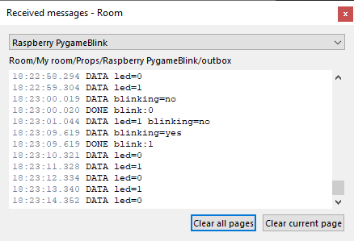

# Pygame Blink props
*Educational example of pure Python props using **pygame**.*

An educational example which makes a LED blinking.

This props uses Pygame and extends <a href="https://github.com/xcape-io/PyProps/blob/master/core/ThreadingProps.py" target="_blank">ThreadingProps</a> (so it uses multi-threading) .


## Installation
See [INSTALLATION.md](.../INSTALLATION.md) and as a good habit is the PyProps folder is `/home/pi/Room/Props/PyProps`

### Dependencies
If you don't install the whole PyProps library, you will have to fulfill the  *PygameBlinkProps* requirements:
* `PyProps/core/ThreadingProps.py`
* `PyProps/core/PropsApp.py`
* `PyProps/core/MqttApp.py`
* `PyProps/core/PropsData.py`
* `PyProps/core/Singleton.py`

And you will have to install following Python packages:
```bash
$ pip3 install paho-mqtt
$ pip3 install PyYAML
```

## Usage
Start `main.py` script in `/home/pi/Room/Props/PyProps/PygameProps/PygameBlinkProps`:

```bash
pi@raspberrypi:~ $ python3 ~/Room/Props/PyProps/PygameProps/PygameBlinkProps/main.py -s 192.168.1.42 -d

Config: {'host': '192.168.1.42'}

```


## SSH relaunch command
The command to relaunch the props is :

```bash
$ ps aux | grep python | grep -v "grep python" | grep PygameBlinkProps/main.py | awk '{print $2}' | xargs kill -9 && screen -d -m python3 /home/pi/Room/Props/PyProps/PygameProps/PygameBlinkProps/main.py -s %BROKER%
```


## Pygame Blink Props as a props for <a href="https://xcape.io/" target="_blank">*xcape.io* **Room**</a>
To use *PygameBlinkProps* as a props for <a href="https://xcape.io/" target="_blank">*xcape.io* **Room**</a> software, here are props commands and messages as well as a suggested control panel.

### Props commands
* `blink:0` : deactivate blinking
* `blink:1` : activate blinking

### Props configuration
Add and configure *Raspberry PygameBlink* connected props.


### Props data messages



### Props control panel


## Author

**Marie FAURE** (Apr 10th, 2020)
* company: FAURE SYSTEMS SAS
* mail: *dev at faure dot systems*
* github: <a href="https://github.com/xcape-io?tab=repositories" target="_blank">xcape-io</a>
* web: <a href="https://xcape.io/" target="_blank">xcape.io</a>