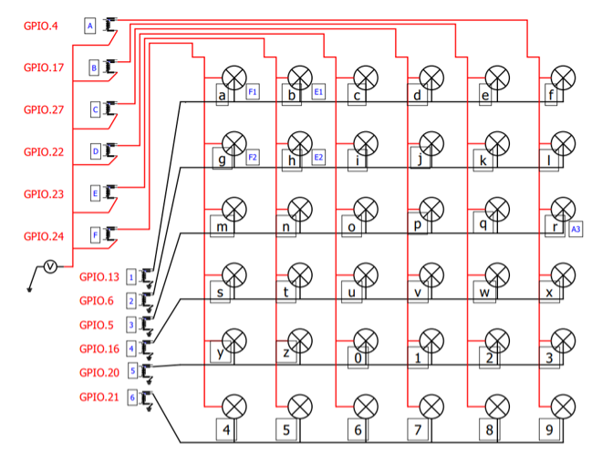

# FortuneTellerTableProps (Alphabet) props
*A props from <a href="https://www.live-escape.net/" target="_blank">Live Escape Grenoble</a> using **PyQt5**.*

A real word props, we have created a fortune teller table with a cowhide top and 36 flashable alphanum characters with powerful LEDs, this props (named *alphabet* in French at the time) is powered by a Raspberry Pi; the game master send a clue which is spelled  character LEDs. Some flashing effects are available to scare players.

Players must place a Tarot card in the correct place on the table to win the challenge that opens the door to the lounge.

This is a good example of RFID shield.

The LEDs are wired in a matrix:



SRD relays have been replaced with transistors to be silent and reliable:


We use a MIFARE RFID-RC522 module:


## Installation
This props was created before PyProps library was released so there is no dependencies with PyProps.

You will have to install following Python packages:
```bash
$ pip3 install paho-mqtt
$ pip3 install PyYAML
```

### RFID-RC522 module configuration
1) enable SPI in **raspi-config**
2) check:
```bash
$ lsmod | grep spi
spidev                 16384  0
spi_bcm2835            16384  0
```
3) install python library
```bash
$ sudo apt-get update
$ sudo apt-get upgrade
```
4) download and install SPI-Py
```bash
$ cd ~
$ git clone https://github.com/lthiery/SPI-Py.git
$ cd ~/SPI-Py
$ sudo python3 setup.py install
```


## Usage
Start `main.py` script in `/home/pi/Room/Props/PyProps/QtConsoleProps/FortuneTellerTableProps/`:

```bash
pi@raspberrypi:~ $ python3 ~/Room/Props/PyProps/QtConsoleProps/FortuneTellerTableProps/main.py -s 192.168.1.42 -d


```


## SSH relaunch command
The command to relaunch the props is :

```bash
$ ps aux | grep python | grep -v "grep python" | grep FortuneTellerTableProps/main.py | awk '{print $2}' | xargs kill -9 && screen -d -m python3 /home/pi/Room/Props/PyProps/QtConsoleProps/FortuneTellerTableProps/main.py -s %BROKER%
```


## Fortune Teller Table Props as a props for <a href="https://xcape.io/" target="_blank">*xcape.io* **Room**</a>
This props is used as a props for <a href="https://xcape.io/" target="_blank">*xcape.io* **Room**</a> software.

### Props commands
Commands are in French; look at the code in `AlphabetApp.performAction()` method.


## Author

**Marie FAURE** (Apr 10th, 2020)
* company: FAURE SYSTEMS SAS
* mail: *dev at faure dot systems*
* github: <a href="https://github.com/xcape-io?tab=repositories" target="_blank">xcape-io</a>
* web: <a href="https://xcape.io/" target="_blank">xcape.io</a>