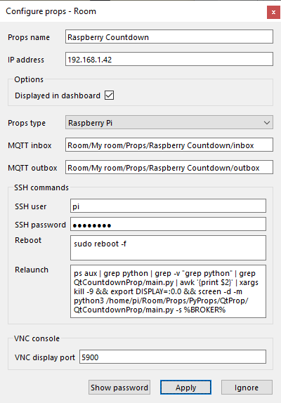
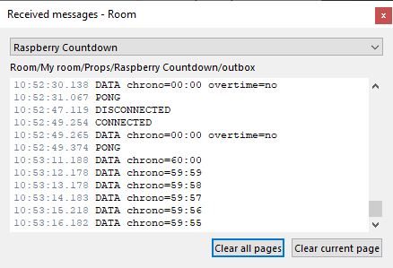
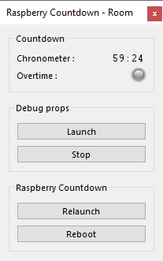

# Qt Countdown prop
*Countdown example of pure Python props using **PyQt5**.*

A prop that displays the game countdown in the escape room on the Raspberry HDMI screen.

This prop uses <a href="https://www.learnpyqt.com/" target="_blank">PyQt5</a> and extends <a href="https://github.com/xcape-io/PyProps/blob/master/core/QtPropApp.py" target="_blank">QtPropApp</a>.

## Installation
This prop was created before *PyProps* library was released so there is no dependencies with PyProps.

You will have to install following Python packages:
```bash
    $ pip3 install paho-mqtt
    $ pip3 install PyYAML
    $ sudo apt-get update
    $ sudo apt-get install qt5-default pyqt5-dev pyqt5-dev-tools
    $ sudo apt-get install python3-pyqt5 python3-pyqt5-dbg
```

### Optionally add audio capability
If you want to extend this prop with sound, `PyQt5.QtMultimedi`a must be installed:

```bash
    $ sudo apt-get update
    $ sudo apt-get install python3-pyqt5.qtmultimedia
```

May have to install **pulseaudio**:

```bash
    $ sudo apt-get upgrade
    $ sudo apt-get install libasound2-dev pulseaudio libpulse-dev
    $ sudo apt-get install libavcodec-dev libavformat-dev libswscale-dev \
        libgstreamer1.0-dev libgstreamer-plugins-base1.0-dev gstreamer1.0-plugins-base \
        gstreamer1.0-plugins-good gstreamer1.0-plugins-ugly gstreamer1.0-plugins-bad \
        libgstreamer-plugins-bad1.0-dev gstreamer1.0-pulseaudio gstreamer1.0-tools \
        gstreamer1.0-alsa
    $ sudo modprobe snd-bcm2835
    $ echo "snd-bcm2835" | sudo tee -a /etc/modules
```

Test  **pulseaudio** (output on HDMI TV monitor):

```bash
pi@raspberrypi:~/Room/Props/PyProps/QtProp/QCountdownProp $ aplay audio/ringtone.wav 
Playing WAVE 'audio/ringtone.wav' : Signed 16 bit Little Endian, Rate 44100 Hz, Stereo
```

## Usage
Start `main.py` script in `/home/pi/Room/Props/PyProps/QtProp/QCountdownProp/`:

```bash
pi@raspberrypi:~ $ python3 ~/Room/Props/PyProps/QtProp/QCountdownProp/main.py -s 192.168.1.42 -d

libEGL warning: DRI2: failed to authenticate
Config: {'host': '192.168.1.42'}
INFO - New periodic action added 'send all data' every 30.0 seconds
INFO - New str Publishable 'chrono' with initial=00:00
INFO - New boolean Publishable 'overtime' (yes/no) with initial=0
INFO - Periodic task created 'send all data' every 30.0 seconds
INFO - Program connected to MQTT server
INFO - Program sending message 'CONNECTED' (mid=1) on Room/My room/Props/Raspberry Countdown/outbox
INFO - Program subscribing to topic (mid=2) : Room/My room/Props/Raspberry Countdown/inbox
INFO - Program subscribing to topic (mid=3) : Room/My room/Control/game:countdown:seconds
INFO - Program sending message 'DATA chrono=00:00 overtime=no' (mid=4) on Room/My room/Props/Raspberry Countdown/outbox
DEBUG - MQTT message is published : mid=1 userdata={'host': '192.168.1.42', 'port': 1883}
INFO - Message published (mid=1)
DEBUG - MQTT topic is subscribed : mid=2 granted_qos=(1,)
INFO - Program susbcribed to topic (mid=2) with QoS (1,)
DEBUG - MQTT topic is subscribed : mid=3 granted_qos=(1,)
INFO - Program susbcribed to topic (mid=3) with QoS (1,)
INFO - Message received : '3537' in Room/My room/Control/game:countdown:seconds
INFO - Program sending message 'DATA chrono=58:57' (mid=5) on Room/My room/Props/Raspberry Countdown/outbox
DEBUG - MQTT message is published : mid=4 userdata={'host': '192.168.1.42', 'port': 1883}
INFO - Message published (mid=4)
INFO - Message received : '@PING' in Room/My room/Props/Raspberry Countdown/inbox
INFO - Program sending message 'PONG' (mid=6) on Room/My room/Props/Raspberry Countdown/outbox
DEBUG - MQTT message is published : mid=5 userdata={'host': '192.168.1.42', 'port': 1883}
INFO - Message published (mid=5)
DEBUG - MQTT message is published : mid=6 userdata={'host': '192.168.1.42', 'port': 1883}
INFO - Message published (mid=6)

```


## SSH relaunch command
The command to relaunch the prop is :

```bash
$ ps aux | grep python | grep -v "grep python" | grep QCountdownProp/main.py | awk '{print $2}' | xargs kill -9 && echo DISPLAY=:0.0 && screen -d -m python3 /home/pi/Room/Props/PyProps/QtProp/QCountdownProp/main.py -s %BROKER%
```

## Qt Countdown Prop as a prop for <a href="https://xcape.io/" target="_blank">*xcape.io* **Room**</a>
To use *QCountdownProp* as a prop for <a href="https://xcape.io/" target="_blank">*xcape.io* **Room**</a> software, here are prop commands and messages as well as a suggested control panel.

### Prop configuration
Add and configure *Raspberry PygameBlink* connected props.



### Prop data messages



### Prop control panel




## Author

**Faure Systems** (Apr 10th, 2020)
* company: FAURE SYSTEMS SAS
* mail: *dev at faure dot systems*
* github: <a href="https://github.com/xcape-io?tab=repositories" target="_blank">xcape-io</a>
* web: <a href="https://xcape.io/" target="_blank">xcape.io</a>