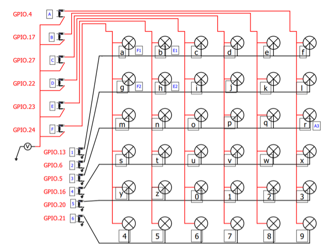

# FortuneTellerTableProp (Alphabet) prop
*A prop from <a href="https://www.live-escape.net/" target="_blank">Live Escape Grenoble</a> using **PyQt5**.*

A real word prop, we have created a fortune teller table with a cowhide top and 36 flashable alphanum characters with powerful LEDs, this prop (named *alphabet* in French at the time) is powered by a Raspberry Pi; the game master send a clue which is spelled  character LEDs. Some flashing effects are available to scare players.

Players must place a Tarot card in the correct place on the table to win the challenge that opens the door to the lounge.

This is a good example of RFID shield.

The LEDs are wired in a matrix:



SRD relays have been replaced with transistors to be silent and reliable:


We use a MIFARE RFID-RC522 module:

http://wiki.sunfounder.cc/index.php?title=Mifare_RC522_Module_RFID_Reader


| RC522 pin | Raspberry Pi 3 pin name   |
|-----------|---------------------------|
| SDA       | GPIO8                     |
| SCK       | GPIO11                    |
| MOSI      | GPIO10                    |
| MISO      | GPIO9                     |
| IRQ       | Not connected             |
| GND       | GND                       |
| RST       | GPIO25                    |
| 3.3V      | 3V3                       |


We have hacked `MFRC522.py` from <a href="https://github.com/mxgxw/MFRC522-python" target="_blank">MFRC522-python</a> for GPIO mode and due to a trange behavior (when a card is present: it loops detected/not detected), we need to read the NFC tag twice.


## Installation
This prop was created before PyProps library was released so there is no dependencies with PyProps.

You will have to install following Python packages:
```bash
    $ pip3 install paho-mqtt
    $ pip3 install PyYAML
    $ sudo apt-get update
    $ sudo apt-get install qt5-default pyqt5-dev pyqt5-dev-tools
```

### RFID-RC522 module configuration
1) enable SPI in **raspi-config**
2) check:
```bash
    $ lsmod | grep spi
    spidev                 16384  0
    spi_bcm2835            16384  0
```
3) install python library
```bash
    $ sudo apt-get update
    $ sudo apt-get upgrade
```
4) download and install SPI-Py
```bash
    $ cd ~
    $ git clone https://github.com/lthiery/SPI-Py.git
    $ cd ~/SPI-Py
    $ sudo python3 setup.py install
```
5) test reading a tag
```bash
    $ sudo python Read.py
```


## Usage
Start `main.py` script in `/home/pi/Room/Props/PyProps/QtProps/FortuneTellerTableProp/`:

```bash
pi@raspberrypi:~ $ python3 ~/Room/Props/PyProps/QtProps/FortuneTellerTableProp/main.py -s 192.168.1.42 -d

INFO - Relay A on output 4 is set to 0
INFO - Relay B on output 17 is set to 0
INFO - Relay C on output 27 is set to 0
INFO - Relay D on output 22 is set to 0
INFO - Relay E on output 23 is set to 0
INFO - Relay F on output 24 is set to 0
INFO - Relay 1 on output 13 is set to 0
INFO - Relay 2 on output 6 is set to 0
INFO - Relay 3 on output 5 is set to 0
INFO - Relay 4 on output 16 is set to 0
INFO - Relay 5 on output 20 is set to 0
INFO - Relay 6 on output 21 is set to 0
INFO - Data change will be published every 1000 milliseconds
INFO - Data full publishing will occur every 30000 milliseconds
INFO - Automation processing will run every 500 milliseconds
INFO - Sketch started
INFO - Sketch running on Raspberry Pi 3
INFO - Program connected to MQTT server
INFO - Program sending message 'CONNECTED' (mid=1) on Live/Demeure/Raspberry Alphabet/outbox
INFO - Program subscribing to topic (mid=2) : Live/Demeure/Raspberry Alphabet/inbox
DEBUG - MQTT topic is subscribed : mid=2 granted_qos=(2,)
INFO - Program susbcribed to topic (mid=2) with QoS (2,)
DEBUG - MQTT message is published : mid=1 userdata={'host': '192.168.1.42', 'port': 1883}
INFO - Message published (mid=1)
INFO - Program sending message 'DATA éclairage=- carte=non' (mid=3) on Live/Demeure/Raspberry Alphabet/outbox
DEBUG - MQTT message is published : mid=3 userdata={'host': '192.168.1.42', 'port': 1883}
INFO - Message published (mid=3)

```


## SSH relaunch command
The command to relaunch the prop is :

```bash
$ ps aux | grep python | grep -v "grep python" | grep FortuneTellerTableProp/main.py | awk '{print $2}' | xargs kill -9 && screen -d -m python3 /home/pi/Room/Props/PyProps/QtProps/FortuneTellerTableProp/main.py -s %BROKER%
```


## Fortune Teller Table Props as a prop for <a href="https://xcape.io/" target="_blank">*xcape.io* **Room**</a>
This prop is used as a prop for <a href="https://xcape.io/" target="_blank">*xcape.io* **Room**</a> software.

### Prop commands
Commands are in French; look at the code in `AlphabetApp.performAction()` method.


## Author

**Marie FAURE** (Apr 10th, 2020)
* company: FAURE SYSTEMS SAS
* mail: *dev at faure dot systems*
* github: <a href="https://github.com/xcape-io?tab=repositories" target="_blank">xcape-io</a>
* web: <a href="https://xcape.io/" target="_blank">xcape.io</a>