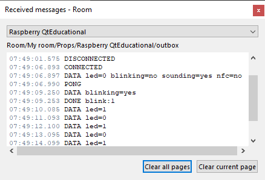
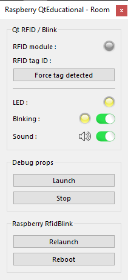

# WORK IN PROGRESS ...

# Qt Countdown prop
*Countdown example of pure Python props using **PyQt5**.*

A prop that displays the game countdown in the escape room on the Raspberry HDMI screen. This prop uses PyQt5 and extends <a href="https://github.com/xcape-io/PyProps/blob/master/core/QtPropsApp.py" target="_blank">QtPropsApp</a>.

## Installation
This prop was created before PyProps library was released so there is no dependencies with PyProps.

You will have to install following Python packages:
```bash
    $ pip3 install paho-mqtt
    $ pip3 install PyYAML
    $ sudo apt-get update
    $ sudo apt-get install qt5-default pyqt5-dev pyqt5-dev-tools
    $ sudo apt-get install python3-pyqt5 python3-pyqt5-dbg
```

PyQt5.QtMultimedia must be installed:

```bash
    $ sudo apt-get update
    $ sudo apt-get install python3-pyqt5.qtmultimedia
```

May have to install **pulseaudio**:

```bash
    $ sudo apt-get upgrade
    $ sudo apt-get install libasound2-dev pulseaudio libpulse-dev
    $ sudo apt-get install libavcodec-dev libavformat-dev libswscale-dev \
        libgstreamer1.0-dev libgstreamer-plugins-base1.0-dev gstreamer1.0-plugins-base \
        gstreamer1.0-plugins-good gstreamer1.0-plugins-ugly gstreamer1.0-plugins-bad \
        libgstreamer-plugins-bad1.0-dev gstreamer1.0-pulseaudio gstreamer1.0-tools \
        gstreamer1.0-alsa
    $ sudo modprobe snd-bcm2835
    $ echo "snd-bcm2835" | sudo tee -a /etc/modules
```

Test  **pulseaudio** (output on HDMI TV monitor):

```bash
pi@raspberrypi:~/Room/Props/PyProps/QtProps/QtCountdownProp $ aplay audio/ringtone.wav 
Playing WAVE 'audio/ringtone.wav' : Signed 16 bit Little Endian, Rate 44100 Hz, Stereo
```

### RFID-RC522 module configuration
1) enable SPI in **raspi-config**
2) check:
```bash
    $ lsmod | grep spi
    spidev                 16384  0
    spi_bcm2835            16384  0
```
3) install python library
```bash
    $ sudo apt-get update
    $ sudo apt-get upgrade
```
4) download and install SPI-Py
```bash
    $ cd ~
    $ git clone https://github.com/lthiery/SPI-Py.git
    $ cd ~/SPI-Py
    $ sudo python3 setup.py install
```
5) test reading a tag
```bash
    $ sudo python Read.py
```


## Usage
Start `main.py` script in `/home/pi/Room/Props/PyProps/QtProps/QtCountdownProp/`:

```bash
pi@raspberrypi:~ $ python3 ~/Room/Props/PyProps/QtProps/QtCountdownProp/main.py -s 192.168.1.42 -d


```


## SSH relaunch command
The command to relaunch the prop is :

```bash
$ ps aux | grep python | grep -v "grep python" | grep QtCountdownProp/main.py | awk '{print $2}' | xargs kill -9 && screen -d -m python3 /home/pi/Room/Props/PyProps/QtProps/QtCountdownProp/main.py -s %BROKER%
```

## Qt Countdown Props as a prop for <a href="https://xcape.io/" target="_blank">*xcape.io* **Room**</a>
To use *QtCountdownProp* as a prop for <a href="https://xcape.io/" target="_blank">*xcape.io* **Room**</a> software, here are prop commands and messages as well as a suggested control panel.

### Props commands
* `sound:0` : mute blinking sound
* `sound:1` : unmute blinking sound

### Props configuration
Add and configure *Raspberry PygameBlink* connected prop.


### Props data messages



### Props control panel




## Author

**Marie FAURE** (Apr 10th, 2020)
* company: FAURE SYSTEMS SAS
* mail: *dev at faure dot systems*
* github: <a href="https://github.com/xcape-io?tab=repositories" target="_blank">xcape-io</a>
* web: <a href="https://xcape.io/" target="_blank">xcape.io</a>