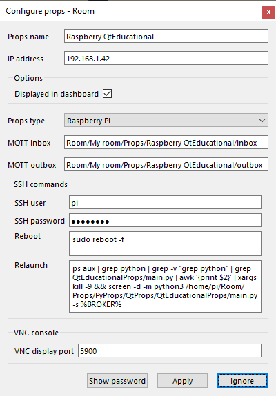
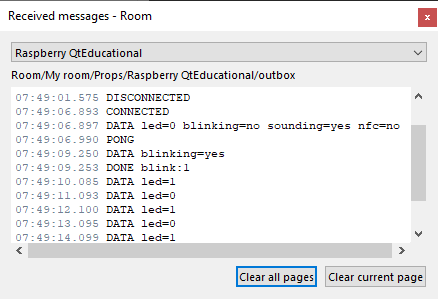
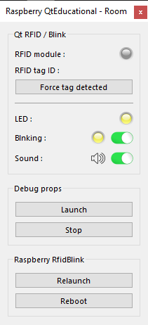

# Qt Educational prop
*Educational example of pure Python prop using **PyQt5**.*

An educational example which makes a LED blinking and making a sound when an RFID tag is detected. And unlock a door when an object (magnetic) is detected by a <a href="https://en.wikipedia.org/wiki/Reed_switch" target="_blank">reed switch</a>.

This prop uses PyQt5 and extends <a href="https://github.com/xcape-io/PyProps/blob/master/core/QtPropApp.py" target="_blank">QtPropApp</a>.

We use a MIFARE RFID-RC522 module:

http://wiki.sunfounder.cc/index.php?title=Mifare_RC522_Module_RFID_Reader

| RC522 pin | Raspberry Pi 3 pin name   |
|-----------|---------------------------|
| SDA       | GPIO8                     |
| SCK       | GPIO11                    |
| MOSI      | GPIO10                    |
| MISO      | GPIO9                     |
| IRQ       | Not connected             |
| GND       | GND                       |
| RST       | GPIO25                    |
| 3.3V      | 3V3                       |


We tested with a NFC Pi Hat as well: <a href="https://www.waveshare.com/wiki/PN532_NFC_HAT" target="_blank">https://www.waveshare.com/wiki/PN532_NFC_HAT</a>

If you need two NFC reader you wil find help at <a href="https://github.com/pat-odoo/TwoRC522_RPi2-3" target="_blank">https://github.com/pat-odoo/TwoRC522_RPi2-3</a>


## Installation
This prop was created before PyProps library was released so there is no dependencies with PyProps.

You will have to install following Python packages:
```bash
    $ pip3 install paho-mqtt
    $ pip3 install PyYAML
    $ sudo apt-get update
    $ sudo apt-get install qt5-default pyqt5-dev pyqt5-dev-tools
    $ sudo apt-get install python3-pyqt5 python3-pyqt5-dbg
```

PyQt5.QtMultimedia must be installed:

```bash
    $ sudo apt-get update
    $ sudo apt-get install python3-pyqt5.qtmultimedia
```

May have to install **pulseaudio**:

```bash
    $ sudo apt-get upgrade
    $ sudo apt-get install libasound2-dev pulseaudio libpulse-dev
    $ sudo apt-get install libavcodec-dev libavformat-dev libswscale-dev \
        libgstreamer1.0-dev libgstreamer-plugins-base1.0-dev gstreamer1.0-plugins-base \
        gstreamer1.0-plugins-good gstreamer1.0-plugins-ugly gstreamer1.0-plugins-bad \
        libgstreamer-plugins-bad1.0-dev gstreamer1.0-pulseaudio gstreamer1.0-tools \
        gstreamer1.0-alsa
    $ sudo modprobe snd-bcm2835
    $ echo "snd-bcm2835" | sudo tee -a /etc/modules
```

Test  **pulseaudio** (output on HDMI TV monitor):

```bash
pi@raspberrypi:~/Room/Props/PyProps/QtProps/QtEducationalProp $ aplay audio/ringtone.wav 
Playing WAVE 'audio/ringtone.wav' : Signed 16 bit Little Endian, Rate 44100 Hz, Stereo
```

### RFID-RC522 module configuration
1) enable SPI in **raspi-config**
2) check:
```bash
    $ lsmod | grep spi
    spidev                 16384  0
    spi_bcm2835            16384  0
```
3) install python library
```bash
    $ sudo apt-get update
    $ sudo apt-get upgrade
```
4) download and install SPI-Py
```bash
    $ cd ~
    $ git clone https://github.com/lthiery/SPI-Py.git
    $ cd ~/SPI-Py
    $ sudo python3 setup.py install
```
5) test reading a tag
```bash
    $ sudo python Read.py
```


## Usage
Start `main.py` script in `/home/pi/Room/Props/PyProps/QtProps/QtEducationalProp/`:

```bash
pi@raspberrypi:~ $ python3 ~/Room/Props/PyProps/QtProps/QtEducationalProp/main.py -s 192.168.1.42 -d

Config: {'host': '192.168.1.42'}
INFO - New periodic action added 'send all data' every 10.0 seconds
INFO - New boolean Publishable 'led' (1/0) with initial=0
INFO - New boolean Publishable 'blinking' (yes/no) with initial=0
INFO - New boolean Publishable 'sounding' (yes/no) with initial=0
INFO - New periodic action added 'blink' every 1.0 seconds
INFO - New boolean Publishable 'nfc' (yes/no) with initial=0
INFO - No NFC module configured'
INFO - Periodic task created 'send all data' every 10.0 seconds
INFO - Periodic task created 'blink' every 1.0 seconds
INFO - Program connected to MQTT server
INFO - Program sending message 'CONNECTED' (mid=1) on Room/My room/Props/Raspberry QtEducational/outbox
INFO - Program subscribing to topic (mid=2) : Room/My room/Props/Raspberry QtEducational/inbox
INFO - Program sending message 'DATA led=0 blinking=no sounding=yes nfc=no' (mid=3) on Room/My room/Props/Raspberry QtEducational/outbox
DEBUG - MQTT message is published : mid=1 userdata={'host': '192.168.1.42', 'port': 1883}
INFO - Message published (mid=1)
DEBUG - MQTT topic is subscribed : mid=2 granted_qos=(1,)
INFO - Program susbcribed to topic (mid=2) with QoS (1,)
DEBUG - MQTT message is published : mid=3 userdata={'host': '192.168.1.42', 'port': 1883}
INFO - Message published (mid=3)
INFO - Message received : '@PING' in Room/My room/Props/Raspberry QtEducational/inbox
INFO - Program sending message 'PONG' (mid=4) on Room/My room/Props/Raspberry QtEducational/outbox
DEBUG - MQTT message is published : mid=4 userdata={'host': '192.168.1.42', 'port': 1883}
INFO - Message published (mid=4)

```


## SSH relaunch command
The command to relaunch the prop is :

```bash
$ ps aux | grep python | grep -v "grep python" | grep QtEducationalProp/main.py | awk '{print $2}' | xargs kill -9 && screen -d -m python3 /home/pi/Room/Props/PyProps/QtProps/QtEducationalProp/main.py -s %BROKER%
```

## Qt Educational Props as a prop for <a href="https://xcape.io/" target="_blank">*xcape.io* **Room**</a>
To use *QtEducationalProp* as a prop for <a href="https://xcape.io/" target="_blank">*xcape.io* **Room**</a> software, here are prop commands and messages as well as a suggested control panel.

### Prop commands
* `blink:0` : deactivate blinking
* `blink:1` : activate blinking
* `sound:0` : mute blinking sound
* `sound:1` : unmute blinking sound

### Prop configuration
Add and configure *Raspberry PygameBlink* connected props.



### Prop data messages



### Prop control panel




## Author

**Marie FAURE** (Apr 10th, 2020)
* company: FAURE SYSTEMS SAS
* mail: *dev at faure dot systems*
* github: <a href="https://github.com/xcape-io?tab=repositories" target="_blank">xcape-io</a>
* web: <a href="https://xcape.io/" target="_blank">xcape.io</a>