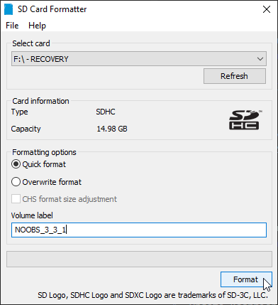
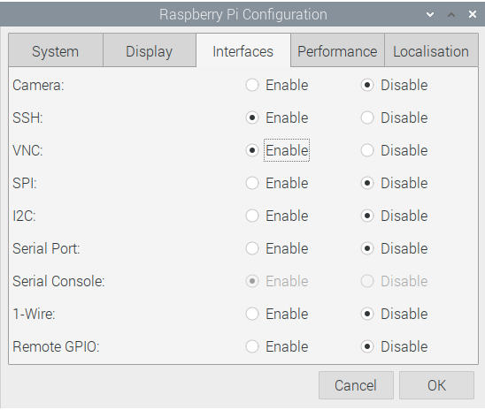

# Raspberry Pi Props

1. [Prepare a clean SD Card ](#1-prepare-a-clean-sd-card)
2. [Install Raspbian with latest NOOBS](#2-install-raspbian-with-latest-noobs)
3. [Complete Raspbian installation](#3-complete-raspbian-installation)
4. [Optional configuration](#4-optional-configuration)
5. [Install *mosquitto* broker](#5-install-mosquitto-broker)

> A Raspberry Pi prop 16GB Raspbian image from NOOBS 3.3.1 (2020-02-14) without optional configuration is available from download from [PROPS_3_3_1.7z](https://sourceforge.net/projects/xcape/files/Pi%20Prop%20Raspbian%20Images/)
>
> <a href="https://www.7-zip.org/" target="_blank">7Zip</a> is required to unflate .7z the image.


## 1. Prepare a clean SD Card 
Format an SD Card (16GB Class 10 U1 recommended) with <a href="https://www.sdcard.org/downloads/formatter/" target="_blank">SD Card Formatter</a> from Tuxera.




## 2. Install Raspbian with latest NOOBS
At the time of writing, the current version is NOOBS 3.3.1.

Download *NOOBS (Offline and network install)* from <a href="https://www.raspberrypi.org/downloads/noobs/" target="_blank">NOOBS page at raspberrypi.org</a> and unzip all files in the clean SD Card.

Insert the SD card in the Raspberry Pi (3B/3B+/4) connected to a keyboard, a mouse and an HDMI screen, and turn on the Raspberry:

1. Let NOOBS boot 
2. Check the box **Raspbian Full** installation
3. Select your language and keyboard
4. Click **Install(i)** and proceed (for a few minutes)
5. When the installation is finished, reboot
6. Complete the wizard that appeared on the first start:
     * set country
     * change password
     * select WiFi network (if relevant)
     * update software


## 3. Complete Raspbian installation
After the first start, it is time to complete the configuration to adapt it to the development of Python 3 props.

1. Enable **VNC** and **SSH** with Raspberry Pi Configuration:


2. Add screen 	
    
    ```bash
    $ sudo apt-get install screen
    ```
**screen** is a full-screen window manager required to start prop program remotely from SSH.

3. MQTT, PyQt5 and Eric IDE

    ```bash
    $ sudo apt-get update
    $ sudo apt-get install qt5-default pyqt5-dev pyqt5-dev-tools
    $ sudo apt-get install eric
    $ sudo pip3 install paho-mqtt PyYAML guizero
    ```

<a href="https://eric-ide.python-projects.org/" target="_blank">Eric IDE</a> is a powerful and user-friendly Python IDE with an easy to use debugger.


## 4. Optional configuration

### Headless HDMI resolution
The resolution you will get by default via VNC is 1280x720, if you have a large monitor display you can change it in `/boot/config.txt`

```bash
    $ sudo nano /boot/config.txt
    ->
    #framebuffer_width=1280
    #framebuffer_height=720
    framebuffer_width=1920
    framebuffer_height=1080
```
    
### Static IP address
Edit `/etc/dhcpcd.conf`

```bash
    $ sudo nano /etc/dhcpcd.conf
    ->
    interface eth0
    
    static ip_address=192.168.0.10/24
    static routers=192.168.0.1
    static domain_name_servers=192.168.0.1
    
    interface wlan0
    
    static ip_address=192.168.0.200/24
    static routers=192.168.0.1
    static domain_name_servers=192.168.0.1
```

### Wifi network configuration
Wifi network configuration is editable, *order is not relevant if several nerworks are available*:

```bash
    $ cat /etc/wpa_supplicant/wpa_supplicant.conf 
    ctrl_interface=DIR=/var/run/wpa_supplicant GROUP=netdev
    update_config=1
    country=FR
    
    #network={
    #	ssid="free_escape"
    #	psk="toto00"
    #	key_mgmt=WPA-PSK
    #}
    
    network={
    	ssid="Linksys_RDC"
    	psk="toto001"
    	key_mgmt=WPA-PSK
    }
```


## 5. Install *mosquitto* broker
> Each room requires a MQTT broker and it's a good idea to run the broker on a Raspberry prop.

Install *mosquitto* broker:
```bash
    $ sudo apt-get install mosquitto

```

### *mosquitto* service
Commands to start / stop the service:
```bash
    $ sudo /etc/init.d/mosquitto stop
    $ sudo /etc/init.d/mosquitto start
    $ sudo /etc/init.d/mosquitto restart
```

Or with *systemctl* :
```bash
    $ systemctl status mosquitto.service
    $ sudo systemctl stop mosquitto.service
    $ sudo systemctl start mosquitto.service
```

### *mosquitto* configuration
To edit *mosquitto* configuration:
```bash
    $ sudo nano /etc/mosquitto/mosquitto.conf
```

#### `mosquitto.conf`

* `log_dest destinations`: send log messages to a particular destination. Possible destinations are: stdout stderr syslog topic.
* `log_type types`: choose types of messages to log. Possible types are: debug, error, warning, notice, information, subscribe, unsubscribe, websockets, none, all.
Defaults to error, warning, notice and information. 
* `connection_messages [ true | false ]`: if set to true, the log will include entries when clients connect and disconnect. If set to false, these entries will not appear.

The reference is : <a href="https://mosquitto.org/man/mosquitto-conf-5.html" target="_blank">mosquitto.conf man page</a>


## Author

**Marie FAURE** (Apr 8th, 2020)
* company: FAURE SYSTEMS SAS
* mail: *dev at faure dot systems*
* github: <a href="https://github.com/xcape-io?tab=repositories" target="_blank">xcape-io</a>
* web: <a href="https://xcape.io/" target="_blank">xcape.io</a>
* original: <a href="https://github.com/xcape-io/PyProps/blob/master/RASPBERRY_PI_PROPS.md" target="_blank">RASPBERRY_PI_PROPS.md</a>